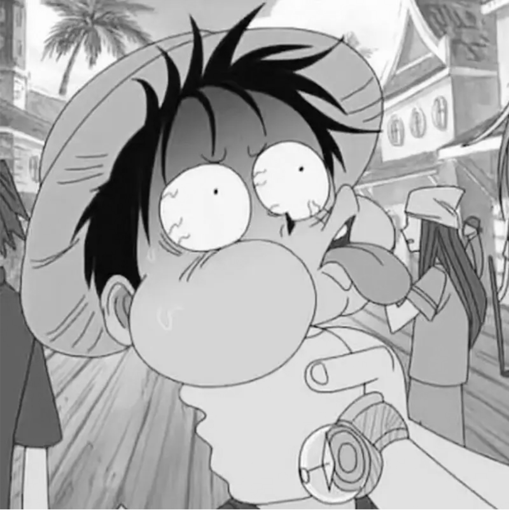
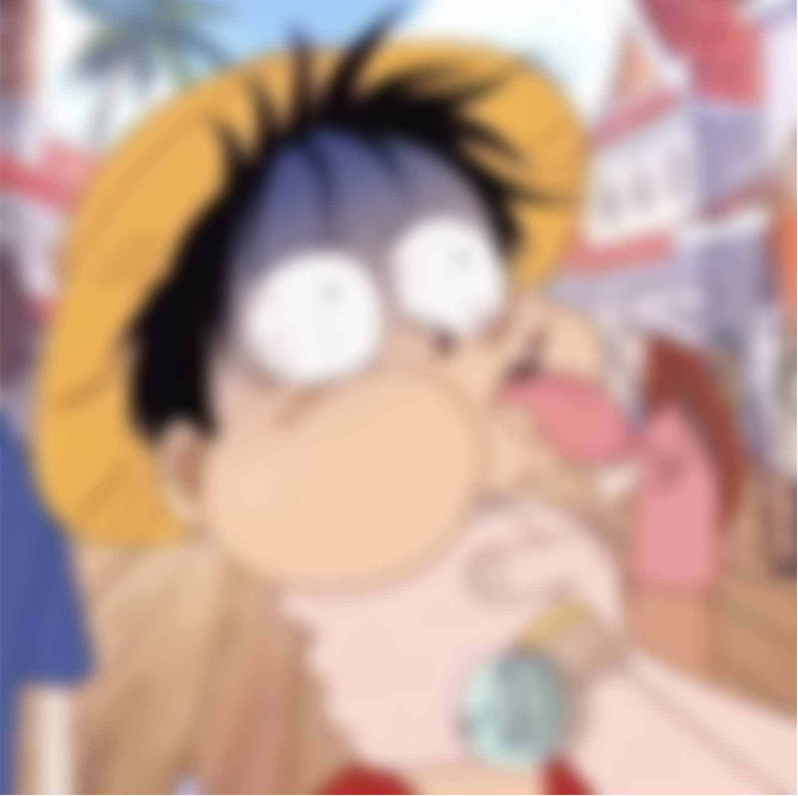
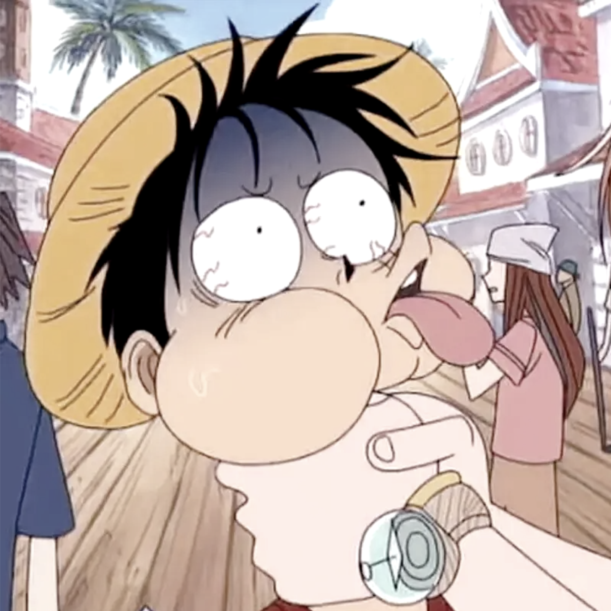
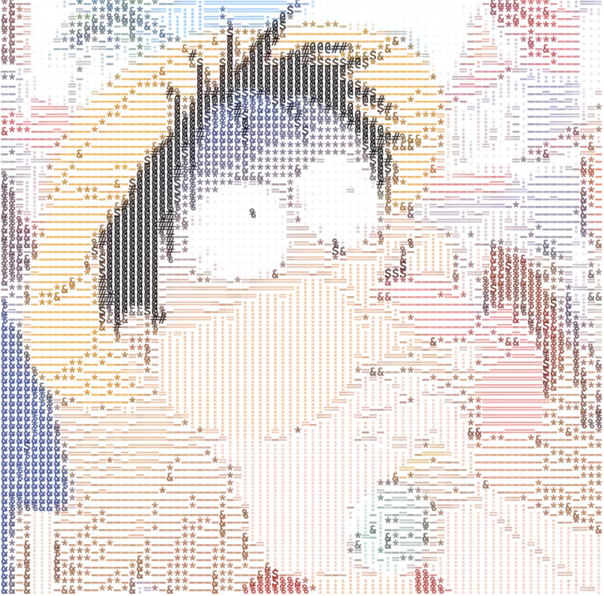
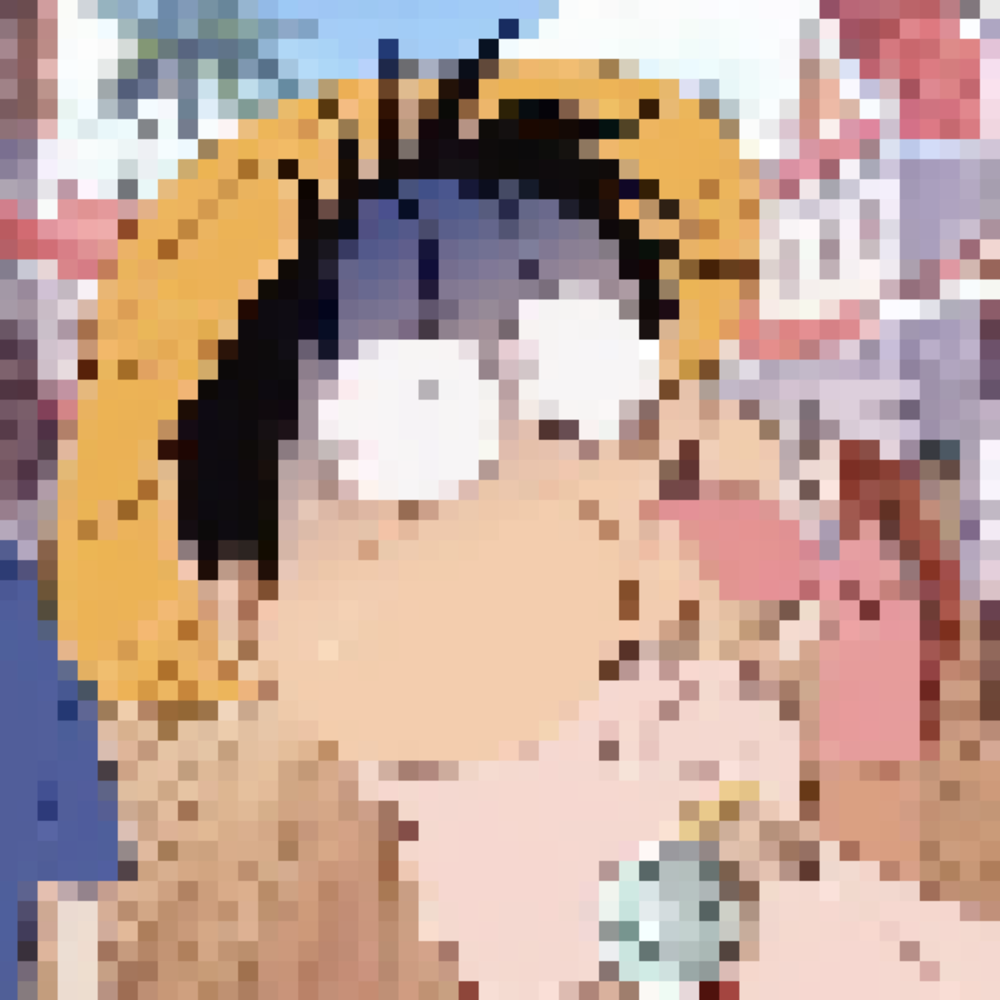
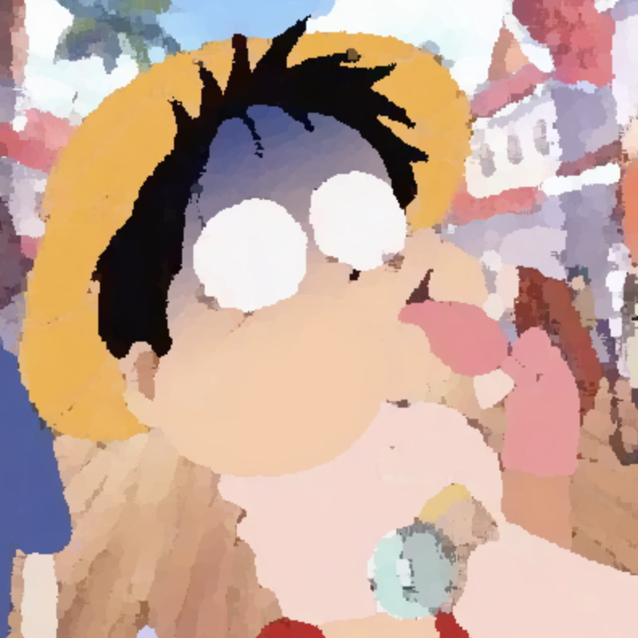

# Image Stylize

Image Stylize Library is a JavaScript/TypeScript library for image processing and filter effects.

## Features

- Apply various image filters.
  - Gaussian Blur
- Convert images to black and white.
- Simulate the Leica camera filter effect.
- Convert image to text drawing
- Convert Image to Pixel Art Style
- Convert Image to Oil Painting Style

## Installation

You can install My Custom Library using npm:

```bash
npm install image-stylize
```

## Usage

Importing the library

```js
import { Stylize } from 'image-stylize';
const stylize = new Stylize({
      width: 800,
      height: 800,
      container: canvasContainerRef.value,
    });
```

## Applying Filters

Black and White Filter

```js
 stylize.draw({
      type: 'grayscale',
      data: {
        url: '/src/assets/a.jpg',
        radius:10,
      },
    });
```



Gaussian Blur Filter

```js
 stylize.draw({
      type: 'grayscale',
      data: {
        url: '/src/assets/a.jpg',
        radius:10,
      },
    });
```



Leica Camera Filter

```js
 stylize.draw({
      type: 'leca',
      data: {
        url: '/src/assets/a.jpg',
      },
    });
```



Convert image to text drawing

```js
 stylize.draw({
      type: 'texty',
      data: {
        url: '/src/assets/a.jpg',
        text: '@#$%&*-=:. ',
        orderly: false,
        scale: 10,
      },
    });
```



Convert Image to Pixel Art Style

```js
 stylize.draw({
      type: "pixel",
      data: {
        url: "/src/assets/a.jpg",
        avarage: 10,
      },
    });
```

Convert Image to Oil Painting Style



```js
 stylize.draw({
      type: "oil",
      data: {
        url: "/src/assets/a.jpg",
        radius: 4,
        intensity: 255,
      },
    });
```



## License

This project is licensed under the MIT License - see the LICENSE.md file for details.

## End

More effects are constantly being updated.